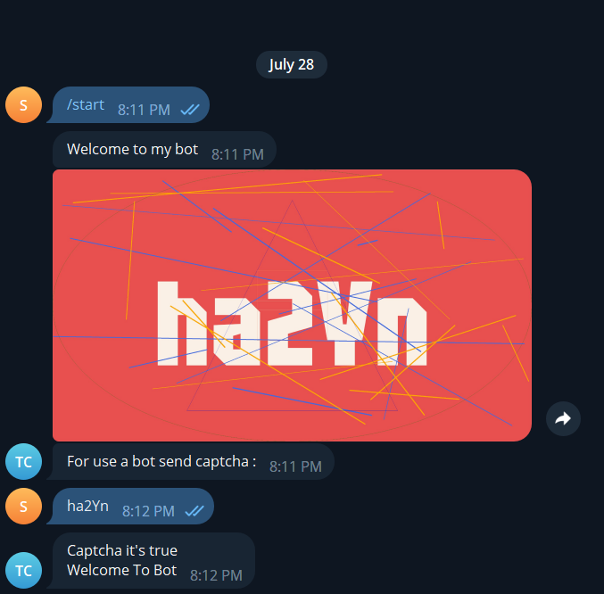

# Captcha Generator
  <br>
  <a href="#"></a>
  <a href="https://pypi.org/project/Pyrogram/"></a>
  <a href="https://pypi.org/project/Pillow/"></a>
  <a href="https://pypi.org/project/Pillow/"></a>
  
<br><br>

## About Project
### The project is designed for Capchaga's telegram robot to make it easier to authenticate users. <br> Of course you can use this project elsewhere and this project is not just for telegram robots.
<br><br>

## Install 
### 
<br>
You Can Get Project From pip use this command : 
<br><br>

```
pip install CaptchaGenerator
```
After if you using windows go to files project open fonts folder and install all fonts.

<br>

## How To Work?
### Temporarily in this version of the project (1.0.0) there is only CaptchaGenerator function for captcha generator. This function has 7 inputs:
* NumberGen
* ValuesCaptcha (optional)
* NameExport (optional)
* PathExport
* Fonts (optional)
* Colors (optional)
* BackgroundS (optional)
<br><br>

## Example :
```python
from CaptchaGenerator.CaptchaGenerator import CaptchaGenerat
def main():
    NumberGen = 5
    NameExport = "CaptchaGenerat"  
    ValuesCaptcha = "012356789QWERTYUIOPASDFGHJKLZXCVBNMqwertyuiopasdfghjklzxcvbnm!@#$%&*"  
    PathExport = r"C:\Users\sepeh\Desktop\Captcha Generator" 
    Fonts = ['AmaticSC-Bold.ttf', 'AmaticSC-Regular.ttf', 'ArchitectsDaughter-Regular.ttf']
    Colors = ["red" , "blue"] 
    BackgroundS = ["Background/Background1.png", "Background/Background2.png", "Background/Background3.png"] 
    choiceFromValues = CaptchaGenerat(NumberGen=NumberGen, ValuesCaptcha=ValuesCaptcha, NameExport=NameExport, PathExport=PathExport, Fonts=Fonts, Colors=Colors, BackgroundS=BackgroundS)
    print("Generated captcha : " + choiceFromValues)
if __name__ == "__main__":
    main()
```
Output Console : 
```
Generated captcha : v*8X$
```
Output Image :


## Example In Telegram (Pyrogram) :
<br>

```python
from pyrogram import Client
from pyrogram.types import Message
from CaptchaGenerator.CaptchaGenerator import CaptchaGenerat
import pyromod

app = Client(
    'app', 
    api_id=123, # API ID
    api_hash="", # API HASH
    bot_token="" # BOT Token
)
@app.on_message()
async def start(client : Client , message : Message):
    if message.text == "/start":
        await message.reply_text("Welcome to my bot")
        choiceFromValues = CaptchaGenerat(NumberGen=5 , NameExport="TelegramCaptcha" ,PathExport=r"c:\path\Captcha Generator")
        await message.reply_photo(photo=r"c:\path\TelegramCaptcha.png")
        Captcha = await message.chat.ask("For use a bot send captcha :")
        if Captcha.text == choiceFromValues:
            await message.reply_text("Captcha it's true\nWelcome To Bot")
        else:
            await message.reply_text("Capcha is not right\nTry Again /start")
app.run()
```


# By <a href="https://t.me/sepehr0day">Sepehr0Day</a>
## update in coming...
